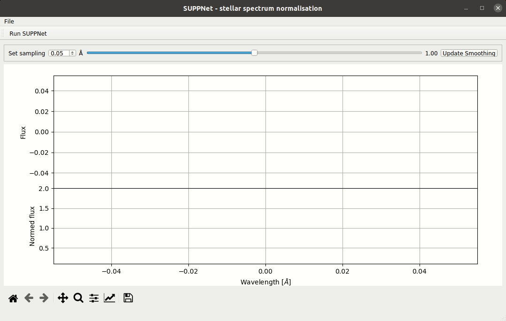

# SUPPNet: Neural network for stellar spectrum normalisation

---

[__SUPPNet: Neural network for stellar spectrum normalisation__](https://rozanskit.com/suppnet/)\
[Różański Tomasz](https://rozanskit.com/)<sup>1</sup>, Niemczura Ewa<sup>1</sup>, Lemiesz Jakub<sup>2</sup>, Posiłek Natalia<sup>1</sup>, Różański Paweł<sup>3</sup>

 

<sup><sub>1. Astronomical Institute, University of Wrocław, Kopernika 11, 51-622 Wrocław, Poland 2. Department  of  Computer  Science,  Faculty  of  Fundamental  Problems  of  Technology,  Wrocław  University  of  Science  and Technology, Wrocław, Poland 3. Faculty  of  Electronics,  Wrocław  University  of  Science  and Technology, Wrocław</sup></sub>

---

## Installing Guide
SUPPNet can be istalled in several simple steps. If you want to test SUPPNet on-line version please check the [link](https://rozanskit.com/suppnet/) (recommended Chrome browser).

### 0. Prerequisites

Install [anaconda](conda.io) Python distribution.

### 1. Download repository

Download `suppnet` repository by:
```
git clone https://github.com/RozanskiT/suppnet.git
```
Now change the directory to `suppnet`:
```
cd suppnet
```

### 2. Handle requirements

Now create and activate a [conda](conda.io) environment `suppnet-env` that handles all dependencies.

```
conda env create -f environment.yml
conda activate suppnet-env
```

## Creating symbolic link in local '~/bin/' directory

The package contains the script SUPPNET.sh which enable user to use suppnet from any place in the system by simply calling `SUPPNET` command. To create symbolic link please make sure that you have local `~/bin` directory by running:
```
ls ~/bin
```
if you do not have `~/bin` directory you can create one by running: `mkdir ~/bin`. Then create link:
```
ln -s ${PWD}/SUPPNET.sh ~/bin/SUPPNET
```
then inspect the result by:
```
ls -l ~/bin/SUPPNET
```
you should see something like:
```
lrwxrwxrwx 1 tr tr 37 wrz 23 11:20 /home/tr/bin/SUPPNET -> /home/tr/repos/suppnet-dev/SUPPNET.sh
```
Having `SUPPNET` script installed correctly you do not need to manually activate suppnet-env environment and you can run any commands described in next paragraph by replacing `python suppnet.py` with just `SUPPNET`. To test if everything runns correctly just run:
```
SUPPNET
```

## Python script usage
After successful environment creation you should be able to use SUPPNet. Start with (make sure that you have environment `suppnet-env` running):
```
python suppnet.py
```
The program window should pop-up and from now you can normalise your spectra. Typical usage scenarios are:

1. Spectrum-by-spectrum normalisation using interactive app:
```
python suppnet.py [--segmentation]
```
2. Normalisation of group of spectra without any supervision:
```
python suppnet.py --quiet [--skip number_of_rows_to_skip] path_to_spec_1.txt [path_to_spec_2.txt ...]
```
3. Manual inspection and correction of previously normalised spectrum, SUPPNet will not be loaded (often used in pair with 2.):
```
python suppnet.py [--segmentation] --path path_to_processing_results.all
```

You can always remind yourself the typical usage by writing:
```
python suppnet.py --help
```

## SUPPNet as python module

You can install and use `suppnet` as regular Python module. Start from activating appropriate environment, e.g.
```
conda activate suppnet-env
```
And then call:
```
pip install -e .
```
For an example usage check the notebook in `notebooks` directory.